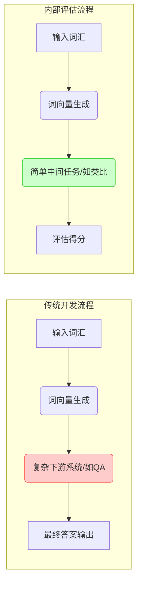

# CS224n 课程笔记 2：词向量 II — GloVe、评估与训练

**课程讲师**：Christopher Manning, Richard Socher  
**作者**：Rohit Mundra, Emma Peng, Richard Socher, Ajay Sohmshetty, Amita Kamath  
**授课学期**：2019 冬季  

---

### 摘要
本篇笔记首先介绍了用于训练词向量的 **GloVe（Global Vectors for Word Representation）**模型。随后，通过讨论词向量（也称为词嵌入，Word Embeddings）的**内部评估（Intrinsic Evaluation）**和**外部评估（Extrinsic Evaluation）**方法，进一步拓展对词向量的讨论。在讨论过程中，我们以**词类比（Word Analogies）**为例，展示了如何利用内部评估技术来调节词嵌入的超参数。接着，我们讨论了在外部下游任务中训练模型权重（参数）和微调词向量的方法。最后，我们阐明了在自然语言处理任务中使用人工神经网络作为一类非线性分类模型的必要性。

---

## 1 词全局向量表示 (Global Vectors for Word Representation, GloVe)

### 1.1 与前人方法的对比 (Comparison with Previous Methods)
到目前为止，我们已经学习了两种主要获取词嵌入的方法：

1. **基于计数的矩阵分解方法**（如 LSA、HAL）：这类方法能够有效利用全局统计信息，但它们主要用于捕捉单词之间的相似度，在词类比（Word Analogy）等结构化任务上表现较差，这表明其学习到的向量空间结构是非最优的。
2. **基于局部窗口的浅层模型**（如 Skip-gram 和 CBOW）：这些模型通过在局部上下文窗口内进行预测来学习词嵌入。虽然它们展现了捕捉除单词相似度之外的复杂语言学模式的能力，但由于采用了滑动窗口的形式，它们**未能有效利用全局的共现统计数据**。

相比之下，**GloVe** 采用了一个**加权最小二乘（Weighted Least Squares）**模型。它在全局单词-单词共现计数（Global Word-Word Co-occurrence Counts）上进行训练，从而实现了对统计数据的高效利用。GloVe 产生的向量空间具有非常有意义的子结构，在词类比任务上表现出了极佳的性能，并在多个词相似度任务上优于当时的其他方法。

### 1.2 共现矩阵 (Co-occurrence Matrix)
为了定义 GloVe 模型，我们先引入如下记号：
> - $X$：单词-单词共现矩阵。
> - $X_{ij}$：单词 $j$ 出现在中心词 $i$ 上下文中的次数。
> - $X_i = \sum_k X_{ik}$：任何单词 $k$ 出现在中心词 $i$ 上下文中的总次数。
> - $P_{ij} = P(w_j | w_i) = \frac{X_{ij}}{X_i}$：单词 $j$ 出现在中心词 $i$ 上下文中的条件概率。

构建该矩阵需要遍历一次整个语料库来收集这些统计数据。对于大型语料库，这步操作在计算上可能会比较昂贵，但这是一次性的前期成本。

### 1.3 最小二乘目标函数 (Least Squares Objective)
回想一下，在 Skip-gram 模型中，我们使用 Softmax 来计算单词 $j$ 出现在中心词 $i$ 上下文中的概率：
$$Q_{ij} = \frac{\exp(u_j^\top v_i)}{\sum_{w=1}^W \exp(u_w^\top v_i)}$$

尽管训练是以在线、随机的方式进行的，但隐式的全局交叉熵损失可以计算为：
$$J = - \sum_{i \in \text{corpus}} \sum_{j \in \text{context}(i)} \log Q_{ij}$$

由于相同的单词对 $(i, j)$ 可能在语料库中多次出现，因此首先将相同的 $i$ 和 $j$ 的项合并同类项按频数分组会更高效：
$$J = - \sum_{i=1}^W \sum_{j=1}^W X_{ij} \log Q_{ij}$$
其中，共现频率的值由共现矩阵 $X$ 给出。

交叉熵损失的一个显著缺点是，它要求概率分布 $Q$ 必须是完全归一化的，这就涉及在整个词汇表上进行昂贵的求和计算。

为了避免这种高昂的计算，GloVe 放弃了归一化项，改用**最小二乘（Least Squares）**目标函数：
$$\hat{J} = \sum_{i=1}^W \sum_{j=1}^W X_i (\hat{P}_{ij} - \hat{Q}_{ij})^2$$
其中，$\hat{P}_{ij} = X_{ij}$ 且 $\hat{Q}_{ij} = \exp(u_j^\top v_i)$ 是未归一化的分布。

然而，这种表述引入了一个新问题——$X_{ij}$ 通常具有极大的动态范围，这使得优化变得十分困难。一个行之有效的改变是**最小化两者的对数的平方误差**：
$$\hat{J} = \sum_{i=1}^W \sum_{j=1}^W X_i (\log \hat{P}_{ij} - \log \hat{Q}_{ij})^2$$
$$= \sum_{i=1}^W \sum_{j=1}^W X_i (u_j^\top v_i - \log X_{ij})^2$$

另一个观察是，权重因子 $X_i$ 不一定是最优的。因此，我们引入了一个更通用的权重函数 $f(X_{ij})$，我们也可以自由地让它依赖于上下文词：
$$\hat{J} = \sum_{i=1}^W \sum_{j=1}^W f(X_{ij}) (u_j^\top v_i - \log X_{ij})^2 \tag{3}$$

> [!NOTE]
> 在 GloVe 的实际实现中，权重函数通常取为如下形式：
> $$f(x) = \begin{cases} \left(\frac{x}{x_{\max}}\right)^\alpha & \text{if } x < x_{\max} \\ 1 & \text{otherwise} \end{cases}$$
> 论文中推荐的经典超参数为 $\alpha = 0.75$ 且 $x_{\max} = 100$。

### 1.4 小结 (Conclusion)
总之，GloVe 模型通过仅在单词-单词共现矩阵的非零元素上进行训练，高效地利用了全局统计信息，并产生了一个包含有意义子结构的向量空间。在相同的语料库、词汇表、窗口大小和训练时间下，它在词类比任务上的表现一致优于 Word2Vec，且能更快地达到更好的效果。

---

## 2 词向量的评估 (Evaluation of Word Vectors)

到现在为止，我们已经讨论了像 Word2Vec 和 GloVe 这样用于在语义空间中训练和发现自然语言单词隐向量表示的方法。在本节中，我们将探讨如何定量评估这些技术产生的词向量的质量。

### 2.1 内部评估 (Intrinsic Evaluation)
词向量的**内部评估**是指：在特定的**中间子任务**（例如类比完成）上评估由词嵌入技术（如 Word2Vec 或 GloVe）产生的词向量。这些子任务通常简单且计算迅速，有助于我们快速理解用于生成词向量的子系统。内部评估通常会返回一个表征词向量在评估子任务上表现的得分。

**动机**：假设我们的最终目标是构建一个使用词向量作为输入的问答系统（Question Answering, QA）。常规做法是训练一个机器学习系统：
1. 接收单词作为输入；
2. 将其转化为词向量；
3. 将词向量作为复杂的深度神经网络（通常拥有数百万甚至数亿参数）的输入；
4. 将该系统输出的向量映射回自然语言单词；
5. 输出单词作为答案。

在这个复杂的下游系统开发过程中，为了找到最佳的词向量表示，我们需要调节 Word2Vec 子系统中的许多超参数（例如词向量维度 $d$）。如果每做一次修改，就重新训练整个下游的深度网络，在工程上是不切实际的，因为训练成本极高。因此，我们需要一种**快速的内部评估方法**来提供词向量质量的粗略衡量。显然，一个核心要求是**内部评估结果与最终外部任务的性能之间应呈正相关**。

### 2.2 外部评估 (Extrinsic Evaluation)
词向量的**外部评估**是指：在具体的**真实下游任务**（例如上述的问答系统）中直接评估产生的词向量。
- 这些任务通常非常复杂，且计算缓慢；
- 在表现不佳时，**很难理清是哪一个子系统出了问题**（是词向量不好、分类器结构不对、还是其他交互部分的缺陷）；
- 如果在下游任务中替换了词向量子系统后系统性能得到了提升，那么这项改动就是好的。

### 2.3 内部评估示例：词类比 (Word Vector Analogies)
词向量内部评估的一个流行选择是其在完成**词向量类比**任务时的表现。在一个词向量类比任务中，我们会被给出一个不完整的类比格式：
$$a : b :: c : ?$$
（例如，*man : king :: woman : ?*）

内部评估系统通过寻找使余弦相似度最大化的词向量 $xd$ 来识别答案：
$$d = \operatorname{argmax}_i \frac{(x_b - x_a + x_c)^\top x_i}{\|x_b - x_a + x_c\|} \tag{4}$$

这个度量有一个直观的解释：理想情况下，我们希望 $x_b - x_a = x_d - x_c$（例如，$\text{queen} - \text{king} = \text{actress} - \text{actor}$），这等价于 $x_b - x_a + x_c = x_d$。因此我们去寻找一个与 $x_b - x_a + x_c$ 的夹角余弦值最大的向量 $x_d$。

使用此类评估时需要注意预训练语料的背景。例如，考虑以下语义类比：
$$\text{City 1} : \text{State containing City 1} :: \text{City 2} : \text{State containing City 2}$$

| 输入 | 系统预测结果 |
| :--- | :--- |
| Chicago : Illinois :: Houston | Texas |
| Chicago : Illinois :: Philadelphia | Pennsylvania |
| Chicago : Illinois :: Phoenix | Arizona |
| Chicago : Illinois :: Dallas | Texas |
| Chicago : Illinois :: Austin | Texas |
| Chicago : Illinois :: Detroit | Michigan |
| Chicago : Illinois :: Boston | Massachusetts |

*表 1：语义词向量类比可能受到同名城市干扰的例子*

在美国，有许多地方重名（例如有至少 10 个地方叫 Phoenix），因此 Arizona 并不是唯一合理的答案。

再比如：
$$\text{Capital City 1} : \text{Country 1} :: \text{Capital City 2} : \text{Country 2}$$

在表 2 中，由于历史原因（例如 1997 年以前哈萨克斯坦的首都是阿拉木图 Almaty，现在是阿斯塔纳 Astana），若预训练语料太旧，也会产生评估偏差。

| 输入 | 系统预测结果 |
| :--- | :--- |
| Abuja : Nigeria :: Accra | Ghana |
| Abuja : Nigeria :: Algiers | Algeria |
| Abuja : Nigeria :: Astana | Kazakhstan |

*表 2：语义类比中受到历史时期不同首都变化影响的例子*

我们同样可以使用类比来评估词向量捕获**语法（Syntax）**信息的能力：

| 输入 | 系统预测结果 |
| :--- | :--- |
| bad : worst :: big | biggest |
| bad : worst :: bright | brightest |
| bad : worst :: good | best |

*表 3：评估形容词最高级的语法类比*

| 输入 | 系统预测结果 |
| :--- | :--- |
| dancing : danced :: decreasing | decreased |
| dancing : danced :: describing | described |
| dancing : danced :: flying | flew |

*表 4：评估动词过去式的语法类比*

### 2.4 内部评估调参示例：类比评估分析 (Analogy Evaluations)
在内部评估任务上，我们可以调节以下超参数：
- 词向量的维度（Dimension of word vectors）
- 语料库的大小（Corpus size）
- 语料库的来源/类型（Corpus source/type）
- 上下文窗口大小（Context window size）
- 上下文的对称性（Context symmetry）

下表展示了不同词向量构建模型在不同的数据集大小和超参数下，在类比任务上的准确率性能对比：

| 模型 | 维度 | 数据集大小 | 语义准确率 (%) | 语法准确率 (%) | 总准确率 (%) |
| :--- | :--- | :--- | :--- | :--- | :--- |
| ivLBL | 100 | 1.5B | 55.9 | 50.1 | 53.2 |
| GloVe | 100 | 1.6B | 67.5 | 54.3 | 60.3 |
| SG | 300 | 1B | 61.0 | 61.0 | 61.0 |
| CBOW | 300 | 1.6B | 16.1 | 52.6 | 36.1 |
| GloVe | 300 | 1.6B | 80.8 | 61.5 | 70.3 |
| CBOW | 300 | 6B | 63.6 | 67.4 | 65.7 |
| SG | 300 | 6B | 73.0 | 66.0 | 69.1 |
| GloVe | 300 | 6B | 77.4 | 67.0 | 71.7 |
| GloVe | 300 | 42B | 81.9 | 69.3 | 75.0 |

*表 5：不同词向量模型在不同超参数与数据集上的性能对比*

根据实验，我们可以得出 3 个主要结论：
1. **性能高度依赖于所使用的模型**：不同模型尝试通过根本上不同的数学属性（如共现次数计数、奇异向量等）来嵌入单词。
2. **性能随语料库大小增加而提升**：数据量越大，模型看到的例子越多。如果测试词汇从未在语料中出现，模型将无法进行类比。
3. **极低维度的词向量表现较差**：低维向量无法捕获词汇表内不同单词的丰富含义。这类似于高偏差（High Bias）问题，即模型的复杂度太低。

> [!TIP]
> **关于词向量维度的探讨**：
> - 直观上，极高维的向量可能会捕捉到语料中的噪声而损害泛化能力（即导致高方差 High Variance 问题）。
> - 然而，Yin 等人在论文《On the Dimensionality of Word Embedding》中表明，Skip-gram 和 GloVe 对这种过度拟合（Overfitting）具有相当强的鲁棒性。
> - 在实践中，**对 GloVe 而言，中心词周围使用大小为 8 的对称窗口通常效果很好**。

### 2.5 内部评估示例：相关性评估 (Correlation Evaluation)
另一个简单的评估方式是使用人类评测数据集（例如 WordSim-353）。让受试人类对一对单词的相似度打分（例如 0 到 10 分），然后计算对应词向量的**余弦相似度与人类打分之间的相关系数**（如 Spearman 或 Pearson 相关系数）。

### 2.6 延伸阅读：处理单词多义性 (Dealing with Ambiguity)
如何处理一词多义（例如 *run* 既是名词又是动词，且在不同上下文语义相差巨大）的情况？

Huang 等人在 2012 年的论文《Improving Word Representations Via Global Context And Multiple Word Prototypes》中提出了一种多原型（Multi-Prototype）解决方法，其核心思想是：
1. 收集该单词所有出现处的固定大小上下文窗口（例如前后各 5 个词）。
2. 将每个上下文表示为上下文单词向量的加权平均值（例如使用 IDF 加权）。
3. 使用球面 K-means（Spherical K-means）对这些上下文表示进行聚类。
4. 最后，将每个出现的单词重新标记为其对应的类别标签（如 $run_1, run_2$），并用于训练对应类别的专属词向量。

---

## 3 外部下游任务的训练 (Training for Extrinsic Tasks)

我们最终的目标是将训练得到的词向量应用于其他外部下游任务。本节将讨论处理外部任务的通用方法。

### 3.1 问题形式化 (Problem Formulation)
大多数 NLP 外部下游任务都可以形式化为分类任务：
- **文本分类**：输入一个句子，将其分类为积极、消极或中性情感。
- **命名实体识别 (NER)**：给定上下文和中心词，将中心词分类为多种实体类别之一。例如输入：
  > *"Jim bought 300 shares of Acme Corp. in 2006"*
  
  输出命名实体标签：
  > *"$[\text{Jim}]_{\text{Person}}$ bought 300 shares of $[\text{Acme Corp.}]_{\text{Organization}}$ in $[\text{2006}]_{\text{Time}}$"*

对于这些问题，我们通常从如下形式的训练集开始：
$$\{x^{(i)}, y^{(i)}\}_{i=1}^N$$
其中 $x^{(i)}$ 是通过词嵌入技术生成的 $d$ 维输入词向量，$y^{(i)}$ 是一个 $C$ 维的独热标签向量，表示我们希望预测的目标类别（情感分类、命名实体、买入/卖出决策等）。

在传统的机器学习任务中，我们通常保持输入数据固定，只通过梯度下降等优化算法来更新模型权重。然而在 NLP 应用中，我们引入了**在训练外部任务的同时重训练/微调（Retraining/Fine-tuning）输入词向量**的想法。

### 3.2 是否重训练词向量？(Retraining Word Vectors)
预训练的词向量是外部任务的一个极好初始化。在微调时，我们可以用外部任务的梯度来进一步调整词向量。但重训练词向量具有一定的风险：

> [!WARNING]
> **微调词向量的局限性（适用于小数据集）**：
> - 预训练词向量将语义相关的词聚集在向量空间的相近区域。
> - 如果我们的外部任务训练集非常小，那么**只有出现在训练集中的单词向量会被更新，而未出现在其中的相关单词（但在测试集中可能会出现）将保持原样**。
> - 这会导致原本聚在一起的语义空间关系被割裂，使分类决策边界失效，从而在测试集上表现更差。

- **小数据集**：建议**保持预训练词向量固定（Static）**，只训练分类器部分的权重。
- **大数据集**：进行**微调/重训练（Fine-tuning）**通常可以取得显著的性能提升。

### 3.3 Softmax 分类与正则化 (Softmax Classification and Regularization)
使用 Softmax 分类器：
$$P(y_j = 1 | x) = \frac{\exp(W_j \cdot x)}{\sum_{c=1}^C \exp(W_c \cdot x)} \tag{5}$$
对于单个样本，交叉熵损失为：
$$-\sum_{j=1}^C y_j \log P(y_j = 1 | x) = -\log \left( \frac{\exp(W_k \cdot x)}{\sum_{c=1}^C \exp(W_c \cdot x)} \right) \tag{6}$$
其中 $k$ 为正确类别的索引。对于 $N$ 个点的数据集，总损失为：
$$J(\theta) = - \sum_{i=1}^N \log \left( \frac{\exp(W_{k^{(i)}} \cdot x^{(i)})}{\sum_{c=1}^C \exp(W_c \cdot x^{(i)})} \right) \tag{7}$$

如果我们同时更新模型权重 $W$ 和所有词向量 $x$，我们需要更新的参数量为：
- 分类器参数：$C \cdot d$
- 词汇表所有单词向量：$|V| \cdot d$
- 总参数量：$C \cdot d + |V| \cdot d$

这是一个非常庞大的参数量，极易导致严重的**过拟合**。为了降低过拟合风险，我们引入了一个 $L_2$ 正则化项：
$$J(\theta) = - \sum_{i=1}^N \log \left( \frac{\exp(W_{k^{(i)}} \cdot x^{(i)})}{\sum_{c=1}^C \exp(W_c \cdot x^{(i)})} \right) + \lambda \sum_{k=1}^{C \cdot d + |V| \cdot d} \theta_k^2 \tag{8}$$
通过将参数的大小压向 0，当超参数 $\lambda$ 调校得当时，可以提高模型的泛化能力。

### 3.4 窗口分类 (Window Classification)
在自然语言中，单个单词存在严重的多义性（例如 *sanction* 可以表示“批准”，也可以表示“制裁”）。在实际应用中，我们很少单独使用一个词向量 $x$ 来进行预测，而是使用一个**序列窗口**：
$$x_{\text{window}}^{(i)} = \begin{bmatrix} x^{(i-2)} \\ x^{(i-1)} \\ x^{(i)} \\ x^{(i+1)} \\ x^{(i+2)} \end{bmatrix} \tag{9}$$
以包含上下文（如长度为 2 的对称窗口）的拼接向量作为模型输入，能够极大帮助系统消除多义词的歧义（例如区分地名 *Paris* 和人名 *Paris*）。

对该拼接输入进行求导时，误差梯度 $\delta_{\text{window}}$ 会被分发到窗口内对应的各个词向量上以完成更新：
$$\delta_{\text{window}} = \begin{bmatrix} \nabla_{x^{(i-2)}} \\ \nabla_{x^{(i-1)}} \\ \nabla_{x^{(i)}} \\ \nabla_{x^{(i+1)}} \\ \nabla_{x^{(i+2)}} \end{bmatrix} \tag{10}$$

### 3.5 非线性分类器 (Non-linear Classifiers)
线性分类器（如逻辑回归、SVM）的决策边界是线性的，其容量有限。在复杂边界的数据分布下，线性决策边界无法完全正确分类。非线性决策边界（例如多层神经网络）能极大地改善对复杂特征的分类表现。在下一篇笔记中，我们将研究作为非线性模型典型代表的神经网络。
